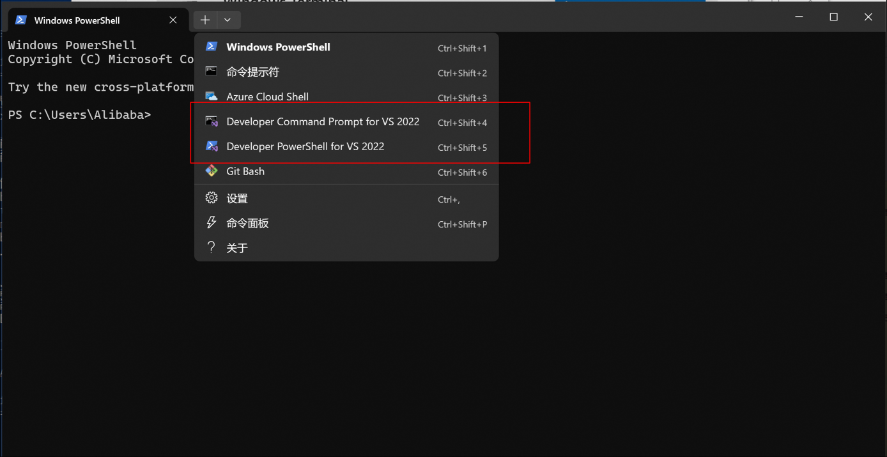

# 示例程序

本章将介绍各个系统平台Demo编译和运行方法, Demo代码位于 `demo`目录：

::: tip
源码使用CMake编译。最新编译好的各个平台库可以从[这里](https://github.com/pixpark/gpupixel/releases/latest)找到
:::

## iOS
确保iOS库已编译好（[参考](build#ios)），xcode 打开 `gpupixel/demo/ios` 下的工程

::: warning
如果是自己创建的 Xcode工程，记得把工程 `Build Settings -> Compress PNG Files  -> NO` 选项关掉，否则会照成图片反色
:::

## Mac
确保MacOS库已编译好([参考](build#mac)), xcode打开 `gpupixel/demo/mac` 下的工程
 
::: warning
如果是自己创建的 Xcode工程，记得把工程 `Build Settings -> Compress PNG Files  -> NO` 选项关掉，否则会照成图片反色
:::

## Android

将生成的 `gpupixel.aar` 拷贝到 `demo/android/app/libs`目录下， 使用Android Studio打开目录 `demo/android`
 
调用逻辑在 `MainActivity` 中，选择 app target 连上手机运行即可

## Desktop

Desktop Demo 编译需要安装以下环境：

### 环境要求
- Microsoft Visual Studio >= 2017 (Windows)
- cmake >= 3.10
- mesa-utils, libglu1-mesa-dev, freeglut3-dev, mesa-common-dev, libglfw3-dev (Linux)

**Windows编译环境配置**

推荐使用 Windows Terminal，在Terminal中选择对应的VS环境Tab后进行编译。

如不使用Windows Terminal，可按如下方式配置：

- **64位编译**：在设置中找到`vcvars64.bat`（适用于 VS 2017 的 x64 本机工具命令提示）并单击，打开VS编译x64架构程序的虚拟环境

::: warning
Windows仅支持生成 x86_64 Release 版本，不支持 x86_32
:::
 
**Linux编译环境配置**

```bash
./script/setup_env_linux.sh
```

### 编译

在配置好环境后，工程根目录下执行批处理文件：

**Windows:**

```bash
.\script\build_windows.bat
```

**Linux:**

```bash
./script/build_linux.sh
```

demo在 `output/bin` 目录

## WebAssembly

### 环境要求
- 支持WebAssembly的现代浏览器（Chrome、Firefox、Safari、Edge）
- NodeJS（用于本地开发）

### 编译

确保WebAssembly库已编译好（[参考](build#webassembly-wasm)）

### 运行

编译完成后，WASM Demo文件位于 `output/bin` 目录。运行Demo步骤如下：

1. 导航到输出目录：
   ```bash
   cd output/bin
   ```

2. 启动本地Web服务器：
   ```bash
   # 使用Python
   python -m http.server
   
   # 或使用Node.js
   npx serve
   ```

3. 打开浏览器并访问 `http://localhost:8000`（或Web服务器指示的端口）

4. Demo界面允许您与桌面版相同的美颜效果进行交互

::: warning
WASM版本不支持人脸关键点检测，依赖人脸检测的滤镜都不可用，如瘦脸，大眼等
:::